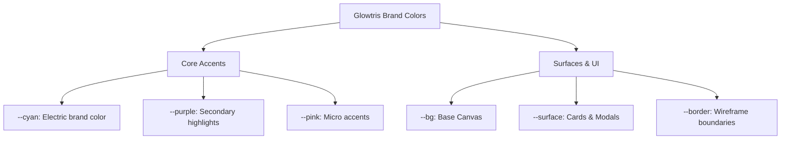

# Glowtris Design System Specification
## ✦ Unified Brand Identity & Interface Foundations

The **Glowtris Design System** harmonizes two distinct worlds: the intense, retro-arcade cyberpunk wireframe environment of the Glowtris game, and the modern, high-contrast, typographically-driven interface of the Glowtris Blog.

By referencing structural categories of the **Google Material Design 3 (M3)** guidelines (such as Color Roles, Typography Scales, Shape Categories, and Elevation), this design system establishes a unified design language tailored to our neon wireframe aesthetic.

---

## 0. Golden Rule & Token Sources

> **Never hardcode a design value (color, size, radius, duration, easing) in component code. Reference a token.** If the value you need has no token, add the token to the source first, then reference it. Then update this document.

| Domain | Blog source of truth | Notes |
| :--- | :--- | :--- |
| Brand colors | `--cyan` `--purple` `--pink` `--green` `--amber` in `app/globals.css` | Light/dark values differ — always use the variable, never the hex. |
| Surface / text / border | `:root` + `[data-theme="dark"]` in `app/globals.css` | Theme switch flips these in place; no separate dark CSS file. |
| Typography | `--font-brand` `--font-body` `--font-mono` in `app/globals.css` | Fonts loaded via `next/font/local` (Pretendard) + Google Fonts (Orbitron, JetBrains Mono). |
| Spacing / shape / shadow / motion | `:root` tokens in `app/globals.css` | See §11 for the complete implemented token list. |
| Component-specific | `--header-bg` `--card-bg` `--code-bg` `--inline-code-*` `--mdx-body` `--blockquote-border` | These adapt per theme; see §11. |

The blog uses **Orbitron** (brand labels) + **Pretendard** (body) — no Orbitron mono. The game is Orbitron-only. Changing a shared brand color means updating both `app/globals.css` and `src/style.css` in the game repo.

---

## 1. Design Philosophy: Cyberpunk Gestalt

Our visual language is guided by three core principles of Gestalt psychology:
1. **Figure-Ground Separation**: High-contrast dark backgrounds paired with layered glowing neon borders and drop-shadows to signify depth and priority.
2. **Proximity & Similarity**: Consistent shape categories (radii) and typography hierarchy to clearly group related elements (e.g., tags, metadata chips, control toggles).
3. **Continuity**: Linear gradients (Cyan to Purple to Pink) create visual flow and connect brand headers directly to interactive elements.

---

## 2. Color System: Cyber Neon

Glowtris adapts Material 3's color roles into a high-contrast Cyber Neon color scheme. Light theme uses deep royal blues and sleek grays for high readability; Dark theme uses electric cyber-colors set against deep cosmos-black backgrounds.

### Core Brand Palette
| Variable | Value (Light) | Value (Dark) | Sample / Semantic Purpose |
| :--- | :--- | :--- | :--- |
| `--cyan` | `#2563eb` (Royal Blue) | `#00c8ff` (Electric Cyan) | Main Brand Accent, Primary buttons, Focus indicators, h2 border-left |
| `--purple` | `#7c3aed` (Deep Violet) | `#a855f7` (Neon Purple) | Secondary Brand Accent, Tags, Blockquote borders |
| `--pink` | `#db2777` (Deep Pink) | `#f472b6` (Neon Pink) | Brand Highlights, Alert borders, Callouts |
| `--green` | `#059669` (Emerald) | `#34d399` (Mint Green) | Success states, Saved indicators, Editor success bar |
| `--amber` | `#d97706` (Amber) | `#fbbf24` (Golden Yellow) | Warning states, Draft badge color, `admin-btn-warning` |

### Surface & Background Tokens
| Variable | Value (Light) | Value (Dark) | Semantic Purpose |
| :--- | :--- | :--- | :--- |
| `--bg` | `#f8f8fc` | `#080814` | Body background, login page backdrop |
| `--surface` | `#ffffff` | `#0e0e20` | Cards, Modals, Editor textarea, admin panels |
| `--surface-2` | `#f0f0f8` | `#141428` | Secondary containers, input backgrounds, toolbar bg |
| `--surface-3` | `#e8e8f4` | `#1c1c34` | Tertiary containers, active tabs, clear button bg |
| `--border` | `rgba(0,0,0,0.06)` | `rgba(255,255,255,0.06)` | Low-contrast separators, card borders |
| `--border-hi` | `rgba(0,0,0,0.10)` | `rgba(255,255,255,0.11)` | Interactive borders, dividers, hero eyebrow |
| `--border-focus` | `rgba(37,99,235,0.40)` | `rgba(0,200,255,0.35)` | Input focus ring (`box-shadow: 0 0 0 3px var(--border-focus)`) |

### Text Hierarchy (4-level proximity scale)
| Variable | Value (Light) | Value (Dark) | Use |
| :--- | :--- | :--- | :--- |
| `--text-primary` | `#0d0d14` | `#f0f0ff` | Headings, card titles, active states |
| `--text-body` | `#2d2d3d` | `rgba(240,240,255,0.88)` | Body copy, descriptions |
| `--text-muted` | `#6b7280` | `rgba(240,240,255,0.50)` | Meta info, subtitles, placeholder labels |
| `--text-faint` | `#a0a6b4` | `rgba(240,240,255,0.28)` | Disabled, hints, section headers in admin |

### Component-specific Color Tokens
| Variable | Light | Dark | Use |
| :--- | :--- | :--- | :--- |
| `--header-bg` | `rgba(248,248,252,0.88)` | `rgba(8,8,20,0.85)` | Sticky header with backdrop-filter |
| `--card-bg` | `#ffffff` | `#0e0e20` | Post card background |
| `--code-bg` | `#f4f4f8` | `rgba(255,255,255,0.03)` | Code block background |
| `--inline-code-bg` | `rgba(37,99,235,0.06)` | `rgba(0,200,255,0.07)` | Inline code chip background |
| `--inline-code-color` | `#1d4ed8` | `#00c8ff` | Inline code text |
| `--mdx-body` | `rgba(13,13,20,0.82)` | `rgba(240,240,255,0.85)` | Long-form article body text |
| `--blockquote-border` | `var(--purple)` | `var(--purple)` | Blockquote left border |



---

## 3. Typography: Arcade vs. Editorial

Glowtris pairs **Orbitron** (a geometric, sci-fi brand typeface) with **Pretendard Variable** (a highly readable, modern sans-serif typeface) to separate decorative gaming labels from readable post bodies.

### Font Stack
| Token | Value | Use |
| :--- | :--- | :--- |
| `--font-brand` | `'Orbitron', sans-serif` | Logo, section labels, filter badges, hero title, 404 code |
| `--font-body` | `'Pretendard Variable', 'Pretendard', -apple-system, …` | All body copy, buttons, inputs, admin UI |
| `--font-mono` | `'JetBrains Mono', 'Fira Code', 'Consolas', monospace` | Code blocks, editor textarea, pane stats |

### Type Scale (Material 3 Inspired)

| M3 Category | Token / Class | Font Family | Weight | Size (Desktop / Mobile) | Line-Height | Semantic Use |
| :--- | :--- | :--- | :--- | :--- | :--- | :--- |
| **Display Large** | `.hero-title` | `'Orbitron'` | `900` | `clamp(36px,6vw,66px)` / `34px` | `1.06` / `1.2` | Page main headers (Blog Hero) |
| **Headline Medium** | `h2` / `.post-title` | `Pretendard` | `700` | `21px` / `18px` | `1.3` / `1.4` | Section titles, Post titles on list views |
| **Title Medium** | `h3` / `.admin-card-title` | `Pretendard` | `700` | `17px` / `15px` | `1.4` | Sub-sections, Admin dashboard lists |
| **Body Medium** | `p` / `.mdx` | `Pretendard` | `400` | `16.5px` / `15px` | `1.9` / `1.65` | Long-form article body copy |
| **Label Small** | `.filter-label` / `.pane-label` | `'Orbitron'` | `700` | `10px` / `10px` | `1.0` | Small tech badges, Category pills, Meta labels |
| **Code Block** | `pre`, `code` | `'JetBrains Mono'` | `400` | `13px` / `12.5px` | `1.7` | Inline code, code blocks, editor textarea |

---

## 4. Shape: Radii Hierarchy

To establish a clear sense of Gestalt *similarity*, border radiuses are grouped systematically:

```
[--r-xs]   4px      →  Inline code chips, small badges (KO/EN lang, draft badge)
[--r-sm]   6px      →  Small buttons, select options, lang toggle buttons, category badge
[--r-md]   8px      →  Input fields, admin buttons, editor tabs, toolbar buttons
[--r-lg]  12px      →  Post list cards, admin cards, editor pane containers, code blocks
[--r-xl]  18px      →  Featured post cards, modal dialogs, main panels, post hero
[--r-full] 9999px   →  Pill CTAs, Category filter buttons, Search bar, hero eyebrow
```

> The blog surface leans toward **Large/XL** (12–18px) for a soft modern reading aesthetic, while the game uses **Small** (6–8px) to preserve the retro-wireframe grid feel. Shared brand radius language: badges = Small, cards = Large/XL, pill actions = Full.

---

## 5. Elevation & Shadow Depth

Material 3's shadow elevation levels (1 to 5) are translated into layered dark-surface shadows with optional neon glow.

| Level | Token | Value (Light) | Value (Dark) | Use |
| :--- | :--- | :--- | :--- | :--- |
| 0 | (none) | — | — | Flat inputs, separated by `--border` |
| 1 | `--shadow-xs` | `0 1px 2px rgba(0,0,0,.05)` | `0 1px 2px rgba(0,0,0,.3)` | Inline code, lang toggle active, toolbar buttons |
| 2 | `--shadow-sm` | `0 2px 8px rgba(0,0,0,.06), 0 1px 2px rgba(0,0,0,.04)` | `0 2px 8px rgba(0,0,0,.3)` | Post cards, hero CTA, admin post cards |
| 3 | `--shadow-md` | `0 8px 24px rgba(0,0,0,.08), 0 2px 6px rgba(0,0,0,.05)` | `0 8px 24px rgba(0,0,0,.4)` | Featured cards, modals, post hero |
| 4 | `--shadow-lg` | `0 20px 48px rgba(0,0,0,.10), 0 4px 12px rgba(0,0,0,.06)` | `0 20px 48px rgba(0,0,0,.5), 0 4px 12px rgba(0,0,0,.3)` | Login card, modals, search results panel |
| 5 | Neon Glow | — | `filter: drop-shadow(0 2px 10px rgba(0,200,255,0.2))` | Hero title on mobile, focused hero CTA |

Card hover adds a cyan glow layer on top of the base shadow:
```css
box-shadow: 0 12px 32px rgba(0, 200, 255, 0.12), 0 4px 12px rgba(0,0,0,0.4);
```

---

## 6. Spacing & 4px Grid

All margins, paddings, and flex gaps are aligned to a 4px base grid.

| Token | Value | Use |
| :--- | :--- | :--- |
| `--space-1` | `4px` | Tight padding, badge internal gaps, dot separator margin |
| `--space-2` | `8px` | Icon-to-text gaps, small button padding, lang toggle gap |
| `--space-3` | `12px` | Tab bar padding, pane label padding, editor tab padding |
| `--space-4` | `16px` | Default container padding, grid gaps, card header gap |
| `--space-5` | `20px` | Admin card padding, post body padding |
| `--space-6` | `24px` | Main article margin-bottom, container horizontal padding |
| `--space-8` | `32px` | Section gaps, hero CTA margin, admin body padding |
| `--space-10` | `40px` | Post page top padding, hero bottom padding |
| `--space-12` | `48px` | Post page top margin, hero top padding (mobile) |
| `--space-16` | `64px` | Hero bottom padding, CTA / nudge margin-top |
| `--space-20` | `80px` | Hero top padding (desktop), post grid bottom padding |

---

## 7. Interactive States & Micro-interactions

Every interactive element has distinct visual responses:

### 1. Hover State
All hovers use `--ease-out` (`cubic-bezier(0.16, 1, 0.3, 1)`) at `--t-fast` (120ms) or `--t-mid` (200ms):

| Element | Hover behavior |
| :--- | :--- |
| Post card | `translateY(-5px)` + cyan border + cyan glow shadow |
| Admin post card | `translateY(-3px)` + cyan border + `shadow-md` |
| Hero CTA | `translateY(-2px)` + cyan border + `box-shadow: 0 8px 24px rgba(0,200,255,0.2)` |
| Post back link | `translateX(-2px)` + cyan color + cyan border |
| Filter button | background → `--surface`, color → `--text-primary` |
| Footer link | color → `--cyan` |

```css
.post-card:hover {
  transform: translateY(-5px);
  border-color: var(--cyan);
  box-shadow: 0 12px 32px rgba(0, 200, 255, 0.12), 0 4px 12px rgba(0,0,0,0.4);
}
```

### 2. Active (Press) State
- Buttons scale down `transform: scale(0.97)` or shift `translateY(1px)`.
- Toolbar buttons: `translateY(0)` + `shadow-xs` on active.

### 3. Focus State (Accessibility)
- Input focus: `border-color: var(--cyan); box-shadow: 0 0 0 3px var(--border-focus);`
- No jarring browser default outlines — all overridden with `outline: none` + custom ring.

### 4. Disabled State
- `opacity: 0.5; cursor: not-allowed;` on `.admin-btn:disabled`.

### 5. Theme Transition
- `body` transitions `background-color` and `color` at `var(--t-mid)` on theme switch — no flash.

---

## 8. Theme Sync & Consistency Guidelines

To maintain visual integrity across the application:
1. **Never use generic pure colors** (e.g., `#ff0000` or `#0000ff`). Use `var(--pink)` or `var(--cyan)`.
2. **Single CSS file, variable swap** — toggling `[data-theme="dark"]` on `<html>` is the only mechanism. No separate dark stylesheets.
3. **Respect mobile constraints** — Touch targets stay above `44px`. Category filters scroll horizontally (`flex-wrap: nowrap`) to avoid vertical clutter on small viewports.
4. **Admin panel is token-native** — Admin UI uses the exact same `:root` tokens as the public blog. No separate admin color palette.

---

## 9. Accessibility & Inclusive Design

### 1. Contrast
- All text must meet WCAG AA (4.5:1 body text, 3:1 large text). `--text-primary` on `--bg` passes in both themes.
- `--text-muted` on `--bg` is borderline on light theme — do not use for body copy, only for metadata.
- Cyan on dark `--bg` passes AA for large text (headlines, labels). Do not use `--cyan` at 12px or below in light theme without a backing surface.

### 2. Bilingual Support (EN/KO)
- Korean (`lang="ko"`) text inherits Pretendard which covers the full Hangul block. No CJK fallback stack needed.
- Line-height for Korean body should be ≥ 1.7 to prevent clipping ascenders/descenders.
- `word-break: keep-all` prevents awkward mid-syllable breaks on narrow viewports.

### 3. Motion Sensitivity
- Gate non-essential animations on `prefers-reduced-motion: reduce`:
  - Disable `translateY` hover lifts, `pulse-badge` keyframe, `fall-rotate` 404 blocks.
  - Keep `color` and `border-color` transitions (they signal state without movement).
- Editor `slide-down-menu` and modal `slide-up` are UI-critical — keep at reduced distance (`4px` instead of `10-12px`).

### 4. Keyboard Navigation
- All interactive elements reachable via Tab. Focus ring always visible — never `outline: none` without a custom replacement.
- Admin modal actions ordered: cancel first, destructive last (right-aligned).

---

## 10. Performance Guidelines

### 1. Font Loading
- **Pretendard**: loaded via `next/font/local` with `display: swap` — zero layout shift, no network round-trip.
- **Orbitron**: Google Fonts with `<link rel="preconnect">` — used only for brand labels (few characters), so subset impact is minimal.
- **JetBrains Mono**: Google Fonts, loaded only when code blocks render. Do not add to global critical path.

### 2. Image Optimization
- Post cover images: use Next.js `<Image>` with `sizes` prop to generate responsive srcsets.
- Emoji covers: rendered as text (zero bytes, no network request). Blur + opacity for depth.
- OG images: generated server-side via `api/og.js` — do not embed large PNGs in MDX.

### 3. CSS Specificity Budget
- No `!important` except for overriding browser resets.
- Component overrides use descendant selectors (`.post-card .post-title`) — max 2 levels deep.
- Theme overrides: single `[data-theme="dark"]` root selector — never nest deeper.

### 4. Rendering Strategy
- Blog index: **SSG** (static, rebuilt on each post push).
- Post pages: **SSG** with `generateStaticParams` — all slugs pre-rendered at build time.
- Admin editor: **CSR** (client-only, behind password wall, not indexed).
- OG + leaderboard API: **Serverless functions** on Vercel.

---

## 11. Implemented Blog Tokens (`app/globals.css`)

The exact token names available in the blog today. Reference these; do not paste raw values.

**Surface** — `--bg` `--surface` `--surface-2` `--surface-3`; borders `--border` `--border-hi` `--border-focus`.

**Text** — `--text-primary` `--text-body` `--text-muted` `--text-faint`.

**Brand** — `--cyan` `--purple` `--pink` `--green` `--amber`.

**Shadow** — `--shadow-xs` `--shadow-sm` `--shadow-md` `--shadow-lg`.

**Shape** — `--r-xs` (4) `--r-sm` (6) `--r-md` (8) `--r-lg` (12) `--r-xl` (18) `--r-full` (9999px).

**Spacing** — `--space-1..20` = 4/8/12/16/20/24/32/40/48/64/80px (keys 1,2,3,4,5,6,8,10,12,16,20).

**Motion** — `--ease-out` (decelerate) `--ease-spring` (bounce); durations `--t-fast` (120ms) `--t-mid` (200ms) `--t-slow` (320ms).

**Component** — `--header-bg` `--card-bg` `--code-bg` `--inline-code-bg` `--inline-code-color` `--mdx-body` `--blockquote-border`.

**Typography** — `--font-brand` (Orbitron) `--font-body` (Pretendard) `--font-mono` (JetBrains Mono).

> Adding/changing a token: edit `:root` and `[data-theme="dark"]` in `app/globals.css`, update this §11 + the relevant section above, then reference it. If the token is also needed in the game, sync with `src/style.css`.

---

## 12. Polish Component Guidelines (Search & Layout)

### 1. Command-K Premium Global Search Modal
To maintain a high-end wireframe aesthetic, the global search modal follows these Material-3 and Gestalt principles:
- **Figure-Ground Separation**: Deep cosmic backdrop (`rgba(8, 8, 20, 0.65)`) with high-level blur (`backdrop-filter: blur(12px)`) shifts reader focus. Container utilizes an outer Cyan neon drop shadow:
  `box-shadow: var(--shadow-lg), 0 0 24px rgba(0, 200, 255, 0.08);`
- **Similarity & Shapes**: Inner list items utilize soft `--r-lg` (12px) shapes, while the outer shell uses `--r-xl` (18px).
- **Continuity & Motion**: Entrance animation splits into a backdrop opacity fade (`modal-fade-in` over 200ms) and container slide-up with overshoot spring deceleration:
  `animation: modal-slide-up var(--t-mid) var(--ease-spring);`

### 2. Copy-to-Clipboard Component (Code Snippet)
- **Interactive State**: Floating visual cue inside syntax-highlighted block elements. Opacity transitions from `0` to `1` smoothly on hover.
- **Feedback Loop**: Active state scales slightly down. Copying triggers a mint-green icon swap transition for immediate success confirmation.
- **Accessibility**: Contains clear `aria-label` tags for screen-reader device visibility.

### 3. Word-Level Document Highlights (Search Results Focus)
- **Cyan Pulse Animation**: Clicking a search result jumps scroll focus to the exact word match, flashing a strong Cyan background (`rgba(0, 200, 255, 0.7)`) before settling into a persistent, non-distracting highlight line:
  `border-bottom: 2px solid var(--cyan); background: rgba(0, 200, 255, 0.2);`
- **Safety**: Safe TreeWalker DOM text node substitution ensures raw HTML markup and scripts are never corrupted.
