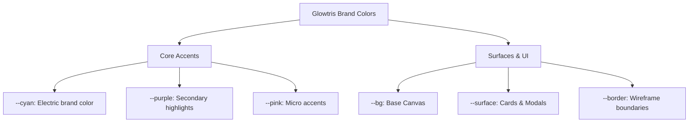

# Glowtris Design System Specification
## ✦ Unified Brand Identity & Interface Foundations

The **Glowtris Design System** harmonizes two distinct worlds: the intense, retro-arcade cyberpunk wireframe environment of the Glowtris game, and the modern, high-contrast, typographically-driven interface of the Glowtris Blog. 

By referencing structural categories of the **Google Material Design 3 (M3)** guidelines (such as Color Roles, Typography Scales, Shape Categories, and Elevation), this design system establishes a unified design language tailored to our neon wireframe aesthetic.

---

## 1. Design Philosophy: Cyberpunk Gestalt

Our visual language is guided by three core principles of Gestalt psychology:
1. **Figure-Ground Separation**: High-contrast dark backgrounds paired with layered glowing neon borders and drop-shadows to signify depth and priority.
2. **Proximity & Similarity**: Consistent shape categories (radii) and typography hierarchy to clearly group related elements (e.g., tags, metadata chips, control toggles).
3. **Continuity**: Linear gradients (Cyan to Purple to Pink) create visual flow and connect brand headers directly to interactive elements.

---

## 2. Color System: Cyber Neon

Glowtris adapts Material 3's color roles into a high-contrast Cyber Neon color scheme. Light theme uses deep royal blues and sleek grays for high readability; Dark theme uses electric cyber-colors set against deep cosmos-black backgrounds.

### Core Brand Palette
| Variable | Value (Light) | Value (Dark) | Sample / Semantic Purpose |
| :--- | :--- | :--- | :--- |
| `--cyan` | `#2563eb` (Royal Blue) | `#00c8ff` (Electric Cyan) | Main Brand Accent, Primary buttons, Focus indicators |
| `--purple` | `#7c3aed` (Deep Violet) | `#a855f7` (Neon Purple) | Secondary Brand Accent, Tags, Blockquote borders |
| `--pink` | `#db2777` (Deep Pink) | `#f472b6` (Neon Pink) | Brand Highlights, Alert borders, Callouts |
| `--green` | `#059669` (Emerald) | `#34d399` (Mint Green) | Success states, Saved indicators, Completed challenges |
| `--amber` | `#d97706` (Amber) | `#fbbf24` (Golden Yellow) | Warning states, Leaderboards, Draft badges |

### Surface & Background Tokens
| Variable | Value (Light) | Value (Dark) | Semantic Purpose |
| :--- | :--- | :--- | :--- |
| `--bg` | `#f8f8fc` | `#080814` | Body background |
| `--surface` | `#ffffff` | `#0e0e20` | Cards, Modals, Editor textareas |
| `--surface-2` | `#f0f0f8` | `#141428` | Secondary containers, input backgrounds |
| `--surface-3` | `#e8e8f4` | `#1c1c34` | Tertiary containers, active tabs |
| `--border` | `rgba(0,0,0,0.06)` | `rgba(255,255,255,0.06)` | Low-contrast separators |
| `--border-hi` | `rgba(0,0,0,0.10)` | `rgba(255,255,255,0.11)` | Interactive borders, focus states |



---

## 3. Typography: Arcade vs. Editorial

Glowtris pairs **Orbitron** (a geometric, sci-fi brand typeface) with **Pretendard Variable** (a highly readable, modern sans-serif typeface) to separate decorative gaming labels from readable post bodies.

### Type Scale (Material 3 Inspired)

| M3 Category | Token / Class | Font Family | Weight | Size (Desktop / Mobile) | Line-Height | Semantic Use |
| :--- | :--- | :--- | :--- | :--- | :--- | :--- |
| **Display Large** | `.hero-title` | `'Orbitron'` | `900` | `66px` / `34px` | `1.06` / `1.2` | Page main headers (e.g., Blog Hero Title) |
| **Headline Medium**| `h2` / `.post-title` | `Pretendard` | `700` | `21px` / `18px` | `1.3` / `1.4` | Section titles, Post titles on list views |
| **Title Medium** | `h3` / `.admin-card-title` | `Pretendard` | `700` | `17px` / `15px` | `1.4` | Sub-sections, Admin dashboard lists |
| **Body Medium** | `p` / `.post-desc` | `Pretendard` | `400` | `15px` / `13px` | `1.65` / `1.6` | General body copy, readable articles |
| **Label Small** | `.filter-label` | `'Orbitron'` | `700` | `10px` / `10px` | `1.0` | Small tech badges, Category pills, Meta info labels |
| **Code Block** | `pre`, `code` | `'JetBrains Mono'` | `400` | `13px` / `12.5px` | `1.7` | In-line code snippet, Code block viewers |

---

## 4. Shape: Radii Hierarchy

To establish a clear sense of Gestalt *similarity*, border radiuses are grouped systematically:

```
[--r-xs] 4px     -->   In-line code chips, very small badges (e.g., KO/EN lang badges)
[--r-sm] 6px     -->   Small button elements, select options, version badges
[--r-md] 8px     -->   Input fields, primary buttons, small cards
[--r-lg] 12px    -->   Post list cards, admin cards, editor pane containers
[--r-xl] 18px    -->   Featured post cards, modal dialogs, main panels
[--r-full] 9999px -->   Pill CTAs, Category filter buttons, Search bar inputs
```

> [!NOTE]
> The game interface leans heavily towards **None (0px)** or **Small (6px)** corners to match the retro-wireframe grid, whereas the blog interface introduces **Large (12px)** and **Extra Large (18px)** corners to create a softer, modern reading aesthetic.

---

## 5. Elevation & Shadow Depth

Material 3's shadow elevation levels (1 to 5) are translated into neon wireframe glow levels and dark-surface shadows.

* **Elevation 0 (Flat)**: Standard cards, flat inputs. Separated strictly via `--border` wireframe strokes.
* **Elevation 1 (`--shadow-xs`)**: In-line code boxes, small toggles. 
* **Elevation 2 (`--shadow-sm`)**: Normal blog cards, admin buttons.
* **Elevation 3 (`--shadow-md`)**: Featured post cards, navigation headers. Added drop-shadow glow:
  `box-shadow: var(--shadow-md), 0 0 12px rgba(0, 200, 255, 0.08);`
* **Elevation 4 (`--shadow-lg`)**: Editor draft lists, user modals, dropdown menus.
* **Elevation 5 (Neon Glow)**: Active/Focused cards, main hero title glows. Implemented via:
  `filter: drop-shadow(0 2px 10px rgba(0, 200, 255, 0.2));`

---

## 6. Spacing & 4px Grid

All margins, paddings, and flex gaps are aligned to a 4px base grid to ensure clean proportion layouts.

* `var(--space-1)`: `4px` (Tight padding, badge internal gaps)
* `var(--space-2)`: `8px` (Icon to text gaps, small buttons padding)
* `var(--space-3)`: `12px` (Tab bar padding, small spacing)
* `var(--space-4)`: `16px` (Default container padding, grid gaps)
* `var(--space-5)`: `20px` (Card internal padding)
* `var(--space-6)`: `24px` (Main article margin-bottom, content gaps)
* `var(--space-8)`: `32px` (Section gaps)
* `var(--space-10)`: `40px` (Hero padding top/bottom)
* `var(--space-12)`: `48px` (Main header spacing)

---

## 7. Interactive States & Micro-interactions

Every interactive element has distinct visual responses:

### 1. Hover State (Transitions)
Hovering on cards, buttons, or links uses the `--ease-out` transition (`cubic-bezier(0.16, 1, 0.3, 1)`) with a `--t-fast` (`120ms`) or `--t-mid` (`200ms`) timing:
* **Card Hovers**: Translates up (`transform: translateY(-5px)`) and elevates shadow (`box-shadow: var(--shadow-lg)`).
* **Button Hovers**: Text/Border changes to `--cyan` or `--pink`. Background shifts slightly.
* **Link Hovers**: Text color changes with a smooth transition.

```css
/* Example of Design Token Implementation on hover */
.interactive-card {
  transition: transform var(--t-mid) var(--ease-out),
              box-shadow var(--t-mid) var(--ease-out);
}
.interactive-card:hover {
  transform: translateY(-4px);
  box-shadow: var(--shadow-md);
  border-color: var(--cyan);
}
```

### 2. Active (Press) State
* Button reduces in scale slightly (`transform: scale(0.97)`) or shifts down (`transform: translateY(1px)`) to provide tactile push response.

### 3. Focus State (Accessibility)
* Outlines are customized to prevent jarring browser defaults:
  `outline: 2px solid var(--border-focus); outline-offset: 3px;`
* On keyboard navigation, focus outline offset increases for clarity (`outline-offset: 4px`).

### 4. Disabled State
* Opacity falls to `0.5`, background cursor changes to `not-allowed`, and pointer-events are disabled.

---

## 8. Theme Sync & Consistency Guidelines

To maintain visual integrity across the application:
1. **Never use generic pure colors**: (e.g., `#ff0000` or `#0000ff`). Instead, use color system variables like `var(--pink)` or `var(--cyan)`.
2. **Combine light & dark themes seamlessly**: Toggling theme must only switch variable values, not swap CSS files.
3. **Respect mobile constraints**: Touch targets (buttons, links) must stay above `44px` height and width for accessibility, and category filters must scroll horizontally (`flex-wrap: nowrap`) to avoid vertical clutter on small viewports.
